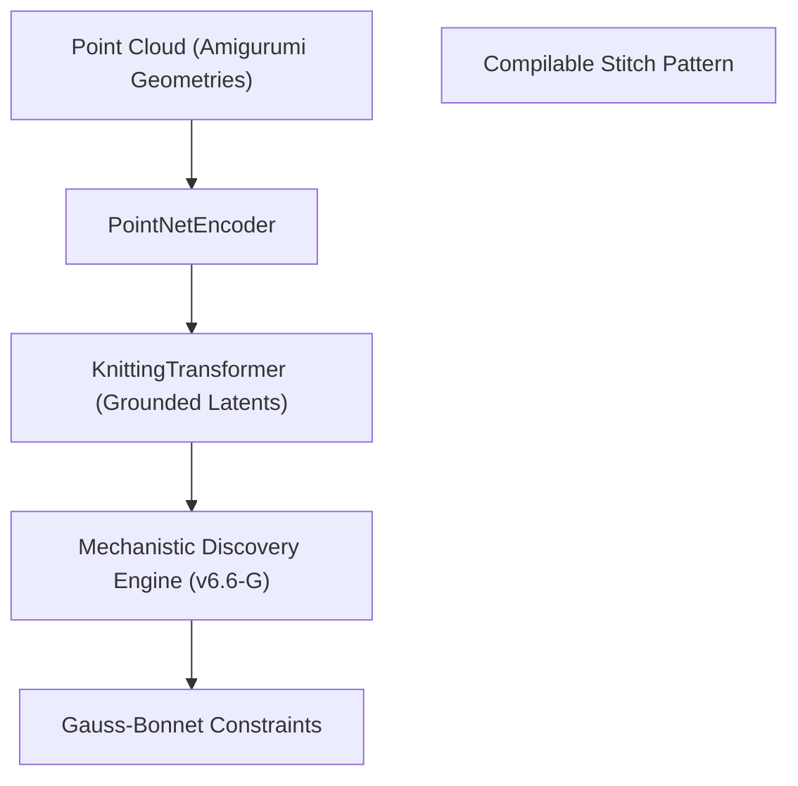

# AlphaKnit 🧶 — v6.6-G "Mechanistic Instrument"

AlphaKnit is a **Mechanistic Discovery Engine** designed to solve the physics of **Amigurumi Topology**. It reframes Machine Learning not as a pattern generator, but as a scientific instrument for exploring geometric morphogenesis.

This version (**v6.6-G**) implements 5 levels of scientific grounding to verify topological emergence and eliminate observer-induced causality illusions.

## 🔬 5 Levels of Scientific Grounding

1.  **Mechanical Truth**: Corrected dynamic layer indexing and isolated probe RNG states to prevent data leakage.
2.  **Physical Invariants**: Implemented **Fixed Anchor Curvature** and **Optimizer Path-Length Persistence** to decouple measurements from training noise.
3.  **Mechanistic Identity**: Introduced **Feature Fingerprints** (via SVD Persistence) to track representational invariants over time.
4.  **Semantic Topology**: Implements **Combinatorial Gauss-Bonnet** tracker to measure discrete curvature flux.
5.  **The Scientific Instrument**: Embeds **Differentiable Topology Pressure** directly into the loss function, forcing the model to respect topological laws.

## 🚀 Key Features

- **Differentiable Discrete Flux Loss**: Enforces curvature conservation via combinatorial angle deficit, closing syntax-only shortcuts.
- **Reproducible Shadow Pass**: True counterfactual interventions using `fork_rng` to isolate causal signals.
- **Topology Tension Field (TTF)**: Structural organization loss based on energetic minimization of the stitch manifold.

## 🏗️ Architecture



## 📊 Capability Milestones

| Milestone | Indicator | Research Significance |
| :--- | :--- | :--- |
| **1. Grammar Barrier** | Violation < 2.0 | Model understands `inc`/`dec` as geometric operations. |
| **2. Emergence Peak** | Stability > 0.8 | Model has formed stable internal directions for "Structure". |
| **3. Morphogenesis** | Shadow Delta > 0.2 | Confirms causal mapping between neurons and physical laws. |

## 🛠️ Usage

### 1. Installation
```cmd
git clone https://github.com/KiettranFNF002/AlphaKnit-Amigurumi.git
cd AlphaKnit-Amigurumi
.\run_pc.bat
```

### 2. Automated Research Pipeline
The pipeline transitions through 3 phases:
1. **PHASE 1 (Syntax)**: Stabilizing grammar and entropy.
2. **PHASE 2 (Transition)**: Inducing physical invariants and optimizer resets.
3. **PHASE 3 (Crystallization)**: Emergence hunting via hypothesis testing.

## 🔬 Scientific Telemetry
Track **Curvature Flux**, **Fingerprint Stability**, and **Structural Margin**:
```bash
python scripts/plot_v6_telemetry.py --history checkpoints/training_history_v6.6F.json
```

## 🧪 Quick Audit (2026-02-22)
- **Bug fixed**: `pyproject.toml` used a non-PEP440 version (`6.6.1-G`) that broke `pip install -e .`.
- **Version consistency fixed**: package metadata now uses valid PEP440 (`6.6.1+g`) while preserving the `v6.6-G` release label in docs.
- **Naive test discovery fixed**: `pytest` now only discovers tests in `/tests` to avoid accidental collection of diagnostic scripts in `/scripts`.
- **Recommended next optimizations**:
  - Split heavyweight dependencies (`torch`, `trimesh`, `webdataset`) into optional extras for faster CI.
  - Add a lightweight CI lane for parser/compiler/tokenizer tests without GPU stack.
  - Add version checks in CI to prevent future metadata drift.

---
**Status**: Research Mode (Mechanistic Discovery)
**License**: MIT
**Build**: v6.6-F-impl-5 (Differentiable Topology Integrated)
