# AlphaKnit 🧶 — v6.6-F "The Blind Discovery"

AlphaKnit is a research-grade Constructive Structural AI that translates 3D point clouds into valid, compilable knitting and amigurumi patterns. 

This version (**v6.6-F**) introduces the **Blind Discovery Engine**, a scientific framework for verifying topological emergence through causal falsification, hidden probes, and state-aware observers.

## 🚀 Key Features (v6.6-F)

- **Causal Intervention Engine**: Injects topological noise or rank-clipping to verify structural causality.
- **Hypothesis Falsification**: Automates the "Discovery" process by verifying the persistence of motifs across epochs.
- **Null Emergence Suite**: Implements placebo-controlled training (Random Labels/Noise) to ensure genuine geometric learning.
- **Observer Purity (Passive Bias)**: Decouples measurement from optimization using rotating probe pools.
- **Topology Tension Field (TTF)**: A structural loss that encourages organization without direct supervision.

## 🏗️ Architecture

```mermaid
graph TD
    A["Point Cloud (N×3)"] --> B["PointNetEncoder (Multi-Scale)"]
    B --> C["KnittingTransformer (Factorized Heads)"]
    C --> D["Blind Discovery Engine (v6.6-F)"]
    D --> E["Stitch Graph (Compiler Validated)"]
```



## 🛠️ Usage

AlphaKnit v6.6-F is optimized for standalone execution on local workstations.

### 1. Installation
Ensure you have Python 3.10+ and an NVIDIA GPU.
```cmd
git clone https://github.com/KiettranFNF002/AlphaKnit-Topology.git
cd AlphaKnit-Topology
.\run_pc.bat
```

### 2. Automated Research Pipeline
The `run_pc.bat` script manages environment setup and transitions through training phases:
1. **PHASE 1 (Grammar Warmup)**: Stabilizing entropy and syntax.
2. **PHASE 2 (Transition)**: Selective Optimizer Reset & Physics Induction.
3. **PHASE 3 (Mastery)**: Hypothesis testing and topological crystallization.

## 📊 Ablation Studies (Research Benchmarks)

AlphaKnit performance is measured by **Compile Success Rate (CSR)** and **Structural Fidelity**.

| Variant | CSR (%) | Topology Fidelity | Note |
|---------|---------|-------------------|------|
| Baseline (v6.0) | 88.4% | Moderate | Sequence-only |
| **v6.6-F (Blind)** | **94.2%** | **High** | With TTF + Causal |

> [!NOTE]
> Detailed ablation reports can be found in `research_reports/` after running the telemetry scripts.

## 🔬 Scientific Telemetry

View research diagnostics and structural metrics:
```bash
python scripts/plot_v6_telemetry.py --history checkpoints/training_history_v6.6F.json
```
This tracks **Phase Lag**, **Rank Stability**, and **Structural Margin** in real-time.

---
**Status**: Research Mode (Phase 11: Scientific Falsification)
**License**: MIT
**Build**: v6.6-F-impl-1 (Causal Hooks Integrated)
